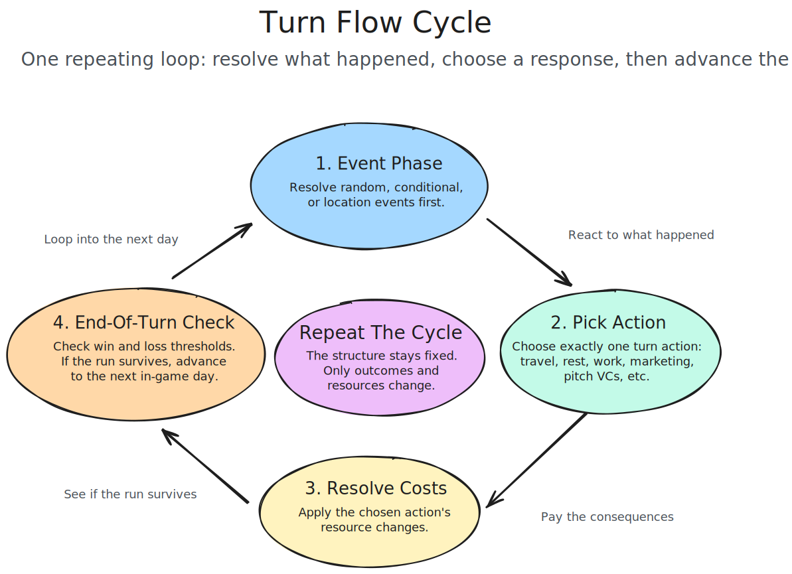
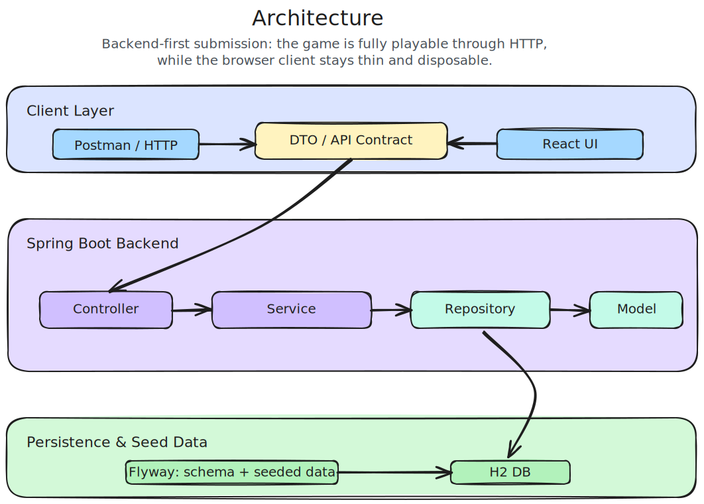
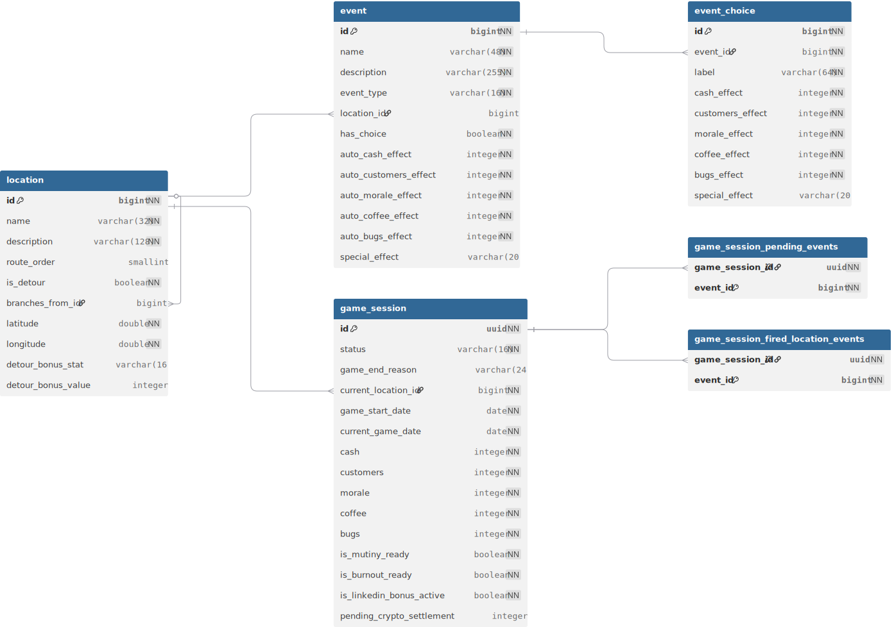

# Silicon Valley Trail API

Silicon Valley Trail is a replayable startup survival game where you go back in time and try to survive as a startup crossing Silicon Valley on the way to San Francisco. Each run plays out on a single historical timeline, so weather and crypto conditions come from the same stretch of past dates instead of feeling disconnected.

This repo contains the Spring Boot backend that owns the game loop, persistence, seeded content, and public API integrations, plus an optional React client in `frontend/`.

## Start Here

- [Quick Start](#quick-start)
- Swagger UI: [http://localhost:8080/swagger-ui.html](http://localhost:8080/swagger-ui.html)
- Postman collection: [postman/collections/svt-api.collection.json](postman/collections/svt-api.collection.json)
- Design notes: [Design Notes](#design-notes)
- Full decision log: [docs/decisions.md](docs/decisions.md)
- Project board: [GitHub Project](https://github.com/users/joe-bor/projects/10)

## Quick Start

### 1. Clone The Repo

```bash
git clone https://github.com/joe-bor/svt.git
cd svt
```

### 2. Prerequisites

- Java 21+
- Node.js 20+ for the optional frontend

### 3. Run The Backend

```bash
./mvnw spring-boot:run
```

Local URLs:

- API base: [http://localhost:8080](http://localhost:8080)
- Swagger UI: [http://localhost:8080/swagger-ui.html](http://localhost:8080/swagger-ui.html)
- OpenAPI JSON: [http://localhost:8080/v3/api-docs](http://localhost:8080/v3/api-docs)
- H2 console: [http://localhost:8080/h2-console](http://localhost:8080/h2-console)

### 4. Run The Optional Frontend

Optional React client in `frontend/`.

```bash
cd frontend
npm install
npm run dev
```

The frontend serves on `http://localhost:5173` and expects the backend on port `8080`.

Override the API base if needed:

```bash
VITE_API_BASE_URL=http://elsewhere:8080 npm run dev
```

### 5. Run Tests

```bash
./mvnw test
```

Verified in this repo: `./mvnw test` currently passes with 152 tests covering gameplay rules, controllers, repositories, integrations, and fallback behavior.

### 6. External APIs And Offline Safety

No API keys are required in the current implementation.

- Weather: [Open-Meteo Historical Weather API](https://open-meteo.com/en/docs/historical-weather-api)
- Crypto: [CoinGecko Market Chart Range API](https://docs.coingecko.com/reference/coins-id-market-chart-range)

There is no separate mock mode to turn on. If either live integration fails, built-in fallback clients provide synthetic weather or crypto data automatically, so local play still works without secrets.

## Game Loop

Each run starts a startup journey across real Silicon Valley locations. The backend returns the current game state, pending events, available actions, next locations, and weather snapshot for the current in-game date.

The flow is:

1. Create a game.
2. Inspect the current state.
3. Resolve any pending event choices and submit one action.
4. Advance the turn when needed.
5. Repeat until the team reaches San Francisco or loses.

Losses are straightforward: the run ends if the company goes bankrupt, loses all customers, or morale bottoms out.

## API Walkthrough

Swagger UI and the Postman collection are the best ways to explore the full API. The examples below cover the main path through a run.

### Create A Game

```bash
curl -i -X POST http://localhost:8080/api/games
```

### Inspect Game State

```bash
curl http://localhost:8080/api/games/<game-id>
```

### Submit Event Choices And An Action

```bash
curl -X POST http://localhost:8080/api/games/<game-id>/actions \
  -H 'Content-Type: application/json' \
  -d '{
    "eventChoices": [],
    "action": {
      "type": "TRAVEL",
      "destinationLocationId": 2
    }
  }'
```

Compact request shape:

```json
{
  "eventChoices": [
    {
      "eventId": 123,
      "choiceId": 456
    }
  ],
  "action": {
    "type": "INVEST_CRYPTO",
    "amount": 500
  }
}
```

Notes:

- `eventChoices` is always present, even when it is an empty array.
- `action.type` is required.
- `destinationLocationId` is used for travel actions.
- `amount` is used for crypto investment actions.

### Advance The Turn

```bash
curl -X POST http://localhost:8080/api/games/<game-id>/turns/next
```

## Design Notes

Full decision log: [docs/decisions.md](docs/decisions.md)

### Tech Stack

- Spring Boot 4
- Spring Web MVC
- Spring Data JPA
- Flyway
- H2
- springdoc / Swagger UI
- Caffeine
- React + Vite for the optional frontend client

### Game Loop And Balance

- The unified historical timeline keeps weather and crypto data coherent inside a run.
- Game depth comes from several layers working together: route choices, resource pressure, different event types, and weather or market swings.
- Events are mixed on purpose. Some are immediate swings like a windfall or setback. Others stop for a player choice that changes the rest of the turn.
- Events are semi-random, and the broader system also includes conditional events tied to game state and API-driven conditions.
- Movement is where the route-specific content shows up, while the ongoing event system keeps the rest of the run from becoming predictable.
- Pending events are persisted between `/turns/next` and `/actions`, so refreshing or repeating the turn call does not reroll results.

### APIs And Their Gameplay Impact

- Open-Meteo affects the run passively through weather-driven pressure and action costs.
- CoinGecko powers a player-chosen high-risk action, so it changes the run through explicit risk and reward decisions.
- I chose CoinGecko because I wanted to work a bit of the blockchain world into the game without forcing the whole project around it. It is also a small homage to blockchain being a big part of what got me into software engineering in the first place.
- Using both lets the game mix world-state pressure with player agency instead of leaning on a single integration pattern.

### Data Modeling And Persistence

- The backend owns the rules and persistence, while the frontend stays thin and optional.
- Game state, routes, events, and seeded content live in the backend and persist across requests.
- Flyway migrations and H2 keep local setup simple while still showing a real schema and seeded data model.

### Error Handling And Offline Behavior

- Offline and API failure cases are handled through fallback clients so the game remains playable.
- Validation, not-found, and domain errors are handled at the API layer instead of being left as generic failures.

### Tradeoffs

- The project invests more depth in the backend systems than in frontend polish.
- The rules aim for a game that is easy to understand, replay, and reason about, instead of chasing a more complex simulation.
- Persisting pending events closes rerolling holes, but it also means the backend has to own more session state.

### If I Had More Time

- Add difficulty levels so the same core game can support different levels of pressure and risk.
- Add a leaderboard for completed game sessions to make replayability more competitive.
- Expand the event catalog and route-specific content so runs diverge more sharply over time.

### Visuals

#### Turn Flow



#### System Architecture



## Data Model

The persistence layer makes the run state real instead of keeping everything in memory for a single request cycle. Flyway migrations create the schema, seed the map and event catalog, and keep local setup simple.

- Database ERD source: [docs/diagrams/svt-flyway-erd.dbml](docs/diagrams/svt-flyway-erd.dbml)
- Interactive dbdiagram: [dbdiagram.io](https://dbdiagram.io/d/svt-69d7f39780896296845dfb1b)



## Further Reading

- Full design rationale: [docs/decisions.md](docs/decisions.md)
- Map and routes: [docs/decisions.md#map--movement](docs/decisions.md#map--movement)
- Economy system: [docs/decisions.md#stats--economy](docs/decisions.md#stats--economy)
- Event system: [docs/decisions.md#events](docs/decisions.md#events)
- Balance overview: [docs/decisions.md#core-game-loop](docs/decisions.md#core-game-loop)

## AI Usage

AI assisted with parts of the implementation, refactoring, tests, and documentation during development. Final design decisions, review, and validation remained with the author.
