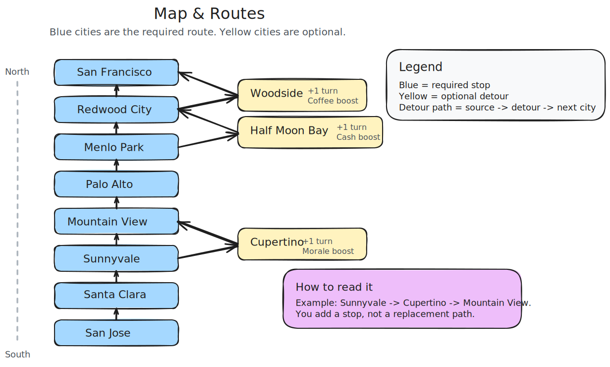
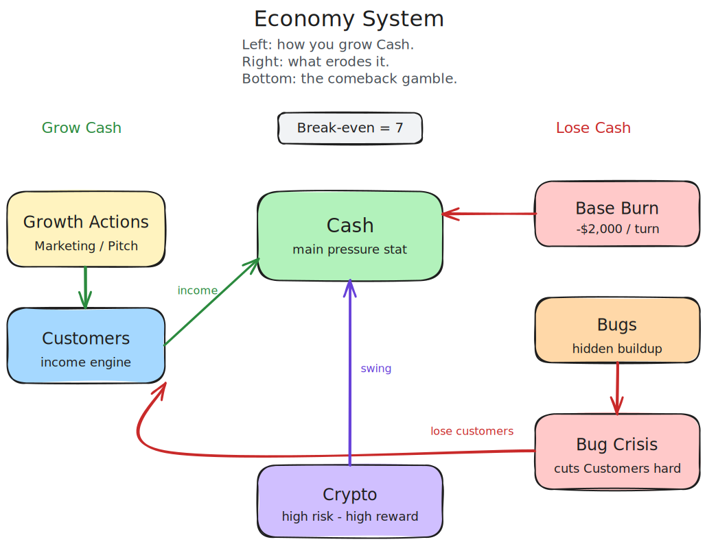
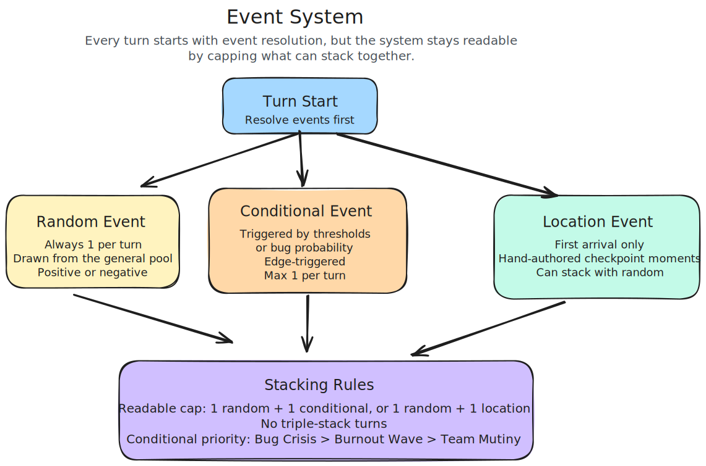
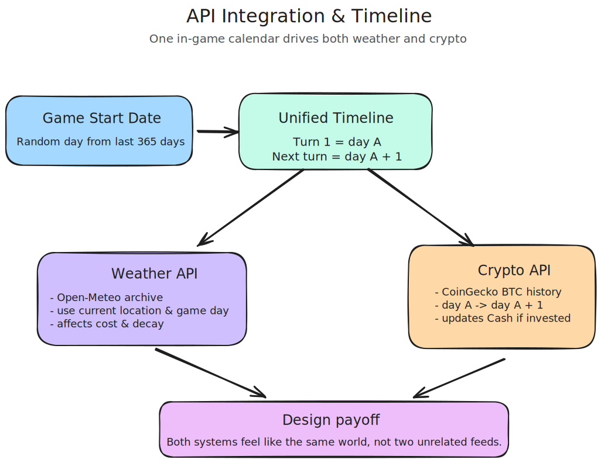
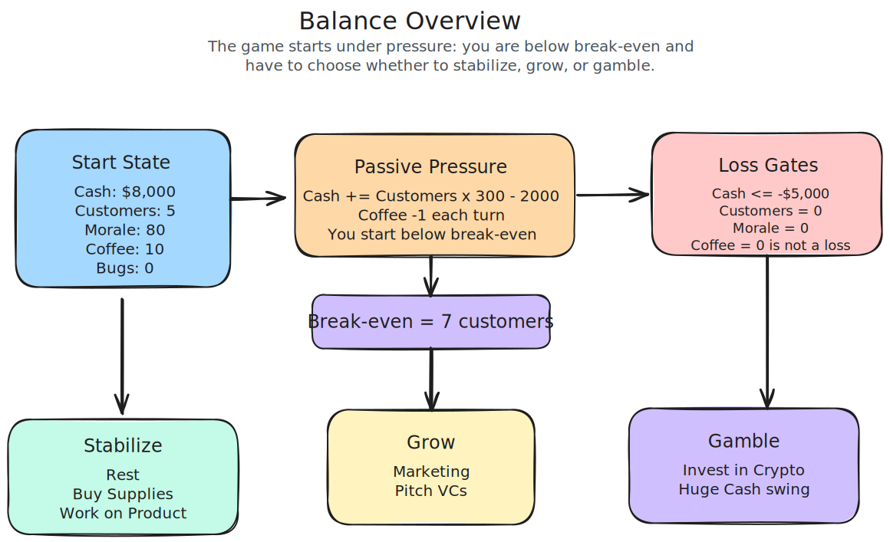

# Design Notes — Silicon Valley Trail

> Captures finalized decisions made where the prompt left room for interpretation or ambiguity.
> Does NOT re-state decisions the prompt already made.
> Maps to the Design Notes deliverable: game loop & balance, API choices, data modeling, error handling, tradeoffs.
> Organized by topic for reviewer readability.

---

## Table of Contents

- [Visual Overview](#visual-overview)
- [Core Game Loop](#core-game-loop)
- [Resource-based pacing over a hard turn limit](#resource-based-pacing-over-a-hard-turn-limit)
- [Multiple simultaneous losing conditions](#multiple-simultaneous-losing-conditions)
- [Turn order: Event then Action then win/loss check](#turn-order-event-then-action-then-winloss-check)
- [Stats & Economy](#stats--economy)
- [4 visible stats, 1 hidden accumulator](#4-visible-stats-1-hidden-accumulator)
- [Cash is the primary constraint, not instant-loss at zero](#cash-is-the-primary-constraint-not-instant-loss-at-zero)
- [Customers as income rate, not a standalone stat](#customers-as-income-rate-not-a-standalone-stat)
- [Map & Movement](#map--movement)
- [Branching paths over linear map](#branching-paths-over-linear-map)
- [1 turn per hop, no variable distance](#1-turn-per-hop-no-variable-distance)
- [Detours as risk/reward, not guaranteed resource stops](#detours-as-riskreward-not-guaranteed-resource-stops)
- [Pit stop detours over fork detours](#pit-stop-detours-over-fork-detours)
- [Actions](#actions)
- [Pitch VCs morale-gated, not location-gated](#pitch-vcs-morale-gated-not-location-gated)
- [Crypto investing as a player-chosen action using real price data](#crypto-investing-as-a-player-chosen-action-using-real-price-data)
- [Event choices are part of event phase, not extra actions](#event-choices-are-part-of-event-phase-not-extra-actions)
- [Action guardrails via natural cost gating](#action-guardrails-via-natural-cost-gating)
- [Events](#events)
- [Multiple events per turn, positive and negative](#multiple-events-per-turn-positive-and-negative)
- [Edge-triggered conditional events with cap of 1 per turn](#edge-triggered-conditional-events-with-cap-of-1-per-turn)
- [API Integration](#api-integration)
- [Two API integrations: weather (event-driven) and crypto (action-driven)](#two-api-integrations-weather-event-driven-and-crypto-action-driven)
- [Unified historical timeline over live data](#unified-historical-timeline-over-live-data)
- [Apparent temperature over actual temperature](#apparent-temperature-over-actual-temperature)
- [BTC with 5x leverage multiplier over altcoins or raw daily delta](#btc-with-5x-leverage-multiplier-over-altcoins-or-raw-daily-delta)
- [Weather modifies both action costs and stat decay](#weather-modifies-both-action-costs-and-stat-decay)
- [Tech Stack & Architecture](#tech-stack--architecture)
- [REST API over CLI for game interface](#rest-api-over-cli-for-game-interface)
- [H2 + JPA + Flyway over in-memory state](#h2--jpa--flyway-over-in-memory-state)
- [React as separate thin frontend client](#react-as-separate-thin-frontend-client)
- [Data Model & Persistence](#data-model--persistence)
- [Four tables plus JPA-managed join tables, not six](#four-tables-plus-jpa-managed-join-tables-not-six)
- [Pending events persisted across HTTP calls](#pending-events-persisted-across-http-calls)
- [Turn phase derived from state, not stored as an enum](#turn-phase-derived-from-state-not-stored-as-an-enum)
- [Game-over reason captured as a typed enum](#game-over-reason-captured-as-a-typed-enum)
- [Crypto settlement pre-computed on invest turn, applied on resolve turn](#crypto-settlement-pre-computed-on-invest-turn-applied-on-resolve-turn)

## Visual Overview

These diagrams are the reviewer-facing visual summary. The `.excalidraw` files in `diagrams/` remain the editable source.

### Turn Flow

Editable source: [turn-flow.excalidraw](diagrams/turn-flow.excalidraw)

### Map & Routes

Editable source: [map-and-routes.excalidraw](diagrams/map-and-routes.excalidraw)

### Economy System

Editable source: [economy-system.excalidraw](diagrams/economy-system.excalidraw)

### Event System

Editable source: [event-system.excalidraw](diagrams/event-system.excalidraw)

### API Integration & Timeline

Editable source: [api-timeline.excalidraw](diagrams/api-timeline.excalidraw)

### Architecture

Editable source: [architecture.excalidraw](diagrams/architecture.excalidraw)

### Balance Overview

Editable source: [balance-overview.excalidraw](diagrams/balance-overview.excalidraw)

## Core Game Loop

### Resource-based pacing over a hard turn limit

**Context:** The prompt defines winning as reaching the destination but sets no upper bound on how long a player can take. A player could rest indefinitely without consequence and still win  
**Options considered:** Hard turn limit / no limit at all / resource-based pacing where stats drain each turn forcing forward progress  
**Decision:** Stats drain passively each turn regardless of action chosen, making indefinite resting unsustainable  
**Reasoning:** A hard turn limit feels arbitrary and punishes deliberate play. Passive stat drain creates the same pressure organically through the existing resource system, no separate constraint needed  
**Trade-off accepted:** Players who understand the drain rates could still play very slowly if they manage resources well, so the pacing pressure is softer than a hard limit

---

### Multiple simultaneous losing conditions

**Context:** The prompt says to define losing conditions and gives examples, but gives no structure for how many there should be or how they interact  
**Options considered:** Single loss condition / multiple independent loss conditions checked each turn  
**Decision:** A loss state is defined, and if any condition is met at end of turn it is game over  
**Reasoning:** Multiple loss vectors mirror real startup failure modes. A company can die from morale collapse just as easily as running out of money, and the system is extensible and clean to implement  
**Trade-off accepted:** Multiple loss vectors increase the chance of a loss feeling arbitrary if thresholds are not tuned carefully

---

### Turn order: Event then Action then win/loss check

**Context:** The prompt's example flow shows events firing after travel actions only. Our design has events firing every turn regardless of action chosen, which changes the natural ordering  
**Options considered:** Action first then event / event first then action  
**Decision:** Event fires first every turn, player reacts with an action, win/loss is checked at end  
**Reasoning:** If events fire after actions, the player's action choice has no relationship to the event they are about to face. Event-first means the player has real information when deciding. They see what happened to their team and then choose how to respond, which creates reactive decision-making and mirrors how a founder actually operates  
**Trade-off accepted:** A bad opening event could immediately remove the player's best action option for that turn, which can feel constraining especially early in the game

## Stats & Economy

### 4 visible stats, 1 hidden accumulator

**Context:** The prompt requires a minimum of 3 stats and provides a list of examples. The specific stats are left to us to decide  
**Options considered:** Use the example flow stats directly / trim to minimum 3 / design a custom set  
**Decision:** Cash, Customers, Morale, and Coffee are visible stats. Bugs is a hidden accumulator, never shown on the dashboard, and only revealed through events  
**Reasoning:** Four visible stats add enough complexity to create tension without overwhelming the player each turn. Customers is more mechanically concrete than Hype because it creates a visible cause-and-effect economy. Keeping Bugs hidden rewards pattern recognition rather than micromanagement  
**Trade-off accepted:** A hidden stat means players may not immediately connect their decisions to bug accumulation. Event messaging needs to make the cause clear or consequences will feel random

---

### Cash is the primary constraint, not instant-loss at zero

**Context:** The prompt lists cash as an example stat but does not define a losing condition for it  
**Options considered:** Instant loss at zero / grace period / allow negative via crypto investing  
**Decision:** Cash can go negative, tied to a crypto investing mechanic with high risk and high reward  
**Reasoning:** An instant loss at zero removes any comeback mechanic and punishes players who take calculated risks. Allowing negative cash tied to investing creates a genuine high-stakes decision point rather than a hard wall  
**Trade-off accepted:** This is harder to balance, and a player could exploit the investing mechanic to indefinitely defer a loss condition

---

### Customers as income rate, not a standalone stat

**Context:** Needed a mechanic that creates a cash economy with inflow and outflow, rather than a flat draining pool  
**Options considered:** Cash as a single draining pool / cash plus a flat money reserve / cash plus customers as inflow rate  
**Decision:** Customers determine how quickly Cash recovers or drains each turn. Each turn: `Cash += (Customers x revenue_per_customer) - operating_cost`. Customers are gained through Marketing and Pitch VCs, and lost through bug crisis events  
**Reasoning:** A single draining pool makes Cash feel like a countdown timer rather than an economy to manage. Separating inflow via Customers from the pool via Cash gives players two levers: grow the business or spend carefully. That creates more interesting decisions. Losing Customers through bug crises also connects the hidden bug accumulator to the visible economy, giving Bugs real teeth  
**Trade-off accepted:** Two interdependent stats add a layer of indirection. The relationship between customers and cash needs to be clearly communicated in the UI or players will not understand why their cash is changing

## Map & Movement

### Branching paths over linear map

**Context:** The prompt requires 10+ real physical locations but defines no map structure  
**Options considered:** Linear path / branching paths / open world  
**Decision:** Branching paths, one main route with 1-2 optional detours per segment  
**Reasoning:** A linear path gives the player no meaningful geographic decisions. Branching creates replayability and lets detours serve as risk-reward trade-offs, without the scope cost of a full open world  
**Trade-off accepted:** More locations means more events to design and test, and branching increases the number of paths through the game that need to be balanced

---

### 1 turn per hop, no variable distance

**Context:** Locations on the map could have variable distances between them, adding a travel cost dimension  
**Options considered:** Variable distance between locations requiring distance math / fixed 1 turn per hop  
**Decision:** Every location-to-location move costs exactly 1 turn. Detours add 1 extra turn. No distance calculations  
**Reasoning:** Variable distance adds a full calculation layer for marginal gameplay benefit. The turn itself is the cost of travel. This keeps the system clean and the player's mental model simple: "travel = 1 day gone"  
**Trade-off accepted:** All legs feel the same weight, which is less realistic but more predictable for the player

---

### Detours as risk/reward, not guaranteed resource stops

**Context:** Branching paths are locked, but the purpose of taking a detour needed definition  
**Options considered:** Detours as guaranteed supply stops / detours as risk/reward trade-offs  
**Decision:** Detours cost 1 extra turn and offer a stat payoff tied to core resources, but random events can still fire on detour turns, potentially eating the benefit  
**Reasoning:** A guaranteed reward makes detours a no-brainer whenever stats are low. Adding the risk of a random event firing on the detour turn creates the core tension: "I need the morale, but can I afford to lose the day?"  
**Trade-off accepted:** A player who gets hit by a bad random event on a detour may feel punished for making a "smart" play, which could feel unfair

---

### Pit stop detours over fork detours

**Context:** Detours are locked as "adds 1 turn," but the branching mechanic needed clarification: does a detour replace the next main route location (fork) or add a side trip before it (pit stop)?  
**Options considered:** Fork model (Cupertino replaces Sunnyvale, same turn count) / pit stop model (Cupertino then Sunnyvale, +1 turn)  
**Decision:** Pit stop model. Detours are side trips that rejoin the main route. Every main route location is always visited  
**Reasoning:** A fork model doesn't actually add a turn (same hop count either way), contradicting the locked design. Worse, it lets players skip main route locations like LinkedIn Campus (Sunnyvale), which has a hand-crafted event. Pit stop preserves the "extra turn cost" trade-off and guarantees all main route content is seen  
**Trade-off accepted:** Players who take all 3 detours add 3 turns to a 9-hop minimum, which extends the game. Balance tuning needs to account for the longer game length

## Actions

### Pitch VCs morale-gated, not location-gated

**Context:** Pitch VCs is the strongest action in the game. Needed a restriction to prevent spamming it every turn  
**Options considered:** Available only at specific VC-heavy locations / available anywhere but requires morale above a threshold  
**Decision:** Morale-gated only. Available at any location as long as morale meets the threshold  
**Reasoning:** Location-gating creates a problem where a player who reaches a VC location with low morale can't use it anyway, and a desperate player at a non-VC location has no path to recovery. Morale-gating alone creates enough restriction while keeping the action accessible. Location events can still enhance pitching without locking the action to a place  
**Trade-off accepted:** Less thematic flavor than "you can only pitch in Menlo Park," but more mechanically fair

---

### Crypto investing as a player-chosen action using real price data

**Context:** Needed a high-risk, high-reward Cash mechanic and a second API integration  
**Options considered:** Crypto as a random event / crypto as a player action / probability-based outcome / real data-based outcome  
**Decision:** Invest in Crypto is an action the player actively chooses. Uses CoinGecko API to pick a random historical date, fetches real BTC price change over a short window, and applies that percentage to the invested amount. Result resolves next turn. No holding mechanic. Fallback: random percentage between -30% and +30%  
**Reasoning:** Making it an action gives the player agency over the risk. Using real price data instead of pure probability makes the mechanic grounded and interesting to talk about in design notes. Resolving next turn keeps it simple without a portfolio tracking system  
**Trade-off accepted:** Real BTC data is volatile, which means some investments will feel unfair in either direction. The player has no information to make an "informed" bet, which is arguably the point

---

### Event choices are part of event phase, not extra actions

**Context:** Some events give the player a choice (e.g., "fix the server yourself or pay for support"). This raised the question of whether event choices are additional actions on top of the 7-action menu  
**Options considered:** Event choices as extra actions / event choices as part of event resolution  
**Decision:** Event choices resolve during the event phase (step 1 of turn order). The player still picks exactly one action per turn from the 7-action menu afterward  
**Reasoning:** Consistent with Oregon Trail's model where event responses and turn actions are separate. Keeps the turn structure clean: react to what happened, then decide what to do. Adding extra actions would complicate the turn flow and make some turns disproportionately powerful  
**Trade-off accepted:** A player hit by a costly event choice and then needing an action to recover may feel squeezed, but that tension is intentional

---

### Action guardrails via natural cost gating

**Context:** When Coffee hits 0, the player cannot perform actions that require Coffee. Needed to define how the game handles this — special forced-action rules or natural restriction  
**Options considered:** Force the player to Rest or Buy Supplies when Coffee = 0 (explicit rule) / simply make coffee-consuming actions unavailable (natural consequence of the cost system)  
**Decision:** Actions that cost Coffee are unavailable when Coffee = 0. The available action list dynamically reflects what the player can afford. At Coffee = 0: Travel, Work on Product, and Pitch VCs are blocked. Rest, Buy Supplies, Marketing, and Invest in Crypto remain available  
**Reasoning:** No special rules needed — the cost system self-enforces. This is cleaner to implement (just check if the player can afford the action's costs before listing it) and more intuitive (same logic applies to any resource constraint, not just Coffee). The player isn't "forced" to rest, they're just unable to travel, which naturally leads them to resupply  
**Trade-off accepted:** A player at Coffee = 0 with no Cash can't Buy Supplies either, leaving only Rest, Marketing (which they also can't afford), and Invest in Crypto (which needs Cash too). This creates a potential soft-lock where the only option is Rest. This is intentional — it mirrors the Burnout Wave's "forced rest" flavor and the player dug themselves into this hole

## Events

### Multiple events per turn, positive and negative

**Context:** The prompt says "an event should happen at each location", singular, and does not clarify whether multiple can stack or whether events are limited to travel turns only  
**Options considered:** One event per turn / multiple events per turn / events only on travel turns  
**Decision:** Multiple events can fire per turn. One random event fires every turn regardless of action chosen, and location events fire additionally upon first arrival at a checkpoint  
**Reasoning:** Limiting events to travel turns makes rest and work turns feel consequence-free, which removes tension and encourages safe play. Multiple events per turn keeps every turn meaningful and unpredictable  
**Trade-off accepted:** Stacking negative events in the same turn could feel punishing and outside the player's control, so probability weights need careful tuning

---

### Edge-triggered conditional events with cap of 1 per turn

**Context:** Three conditional events are stat-gated (Morale < 25, Coffee = 0, bug probability). If checked every turn while the condition is true, Coffee = 0 creates an inescapable death spiral (Burnout steals action → can't buy coffee → Burnout again). Multiple conditionals could also stack in a single turn  
**Options considered:** Let all conditionals stack freely / cap at 1 per turn with level-triggered (fires every turn condition is true) / cap at 1 per turn with edge-triggered (fires once per threshold crossing)  
**Decision:** Edge-triggered with cap of 1 conditional per turn. Priority: Bug Crisis > Burnout Wave > Team Mutiny. A random event can still fire alongside  
**Reasoning:** Level-triggered creates death spirals, especially Burnout at Coffee = 0. Edge-triggered fires once per crossing, giving the player at least one turn to recover. The cap prevents triple-stacking on a single turn when multiple thresholds cross simultaneously. Combined, they keep conditionals punishing but survivable  
**Trade-off accepted:** Edge-triggering means a player sitting at Morale = 20 for five turns only gets hit once, which is more forgiving. The conditional becomes a wake-up call rather than a sustained punishment

## API Integration

### Two API integrations: weather (event-driven) and crypto (action-driven)

**Context:** The prompt requires at least 1 public API that changes gameplay. Two different integration patterns strengthen the submission  
**Options considered:** Weather only / crypto only / both  
**Decision:** Weather API (Open-Meteo) for event-driven gameplay modification, Crypto API (CoinGecko) for action-driven gameplay. Both free, both keyless for basic usage  
**Reasoning:** Weather modifies events and stat drains passively (player doesn't choose it). Crypto modifies Cash actively (player opts in). Two patterns show range and give reviewers more to evaluate. Both have simple fallbacks for offline play  
**Trade-off accepted:** Two API integrations means two sets of error handling, caching, and fallback logic. More surface area for bugs, but manageable given both APIs are simple REST endpoints

---

### Unified historical timeline over live data

**Context:** Weather API (Open-Meteo) fetches current conditions and Crypto API (CoinGecko) uses random historical dates. These two systems are disconnected — weather reflects today's real conditions while crypto references arbitrary past dates. Showing "BTC tracked March 12-19" alongside live April weather breaks immersion. Additionally, live Bay Area weather in April is almost always clear/foggy, limiting weather variety  
**Options considered:** Live weather + random crypto dates / live weather + live crypto (no historical) / unified historical timeline where both APIs pull from the same randomly-selected time period  
**Decision:** At game start, pick a random date from the past 365 days. Each turn = 1 calendar day forward from that date. Both weather and crypto pull from the same historical timeline. Player sees the date displayed each turn  
**Reasoning:** A unified timeline makes the game world coherent — weather and market conditions feel connected because they are. It solves the weather variety problem (winter start dates bring rain and cold, summer brings heat). Different start dates create natural replayability through different conditions. It also enables showing real dates to the player ("Your crypto tracked BTC from Jan 18-19") without timeline confusion  
**Trade-off accepted:** Historical weather data requires the archive endpoint instead of the simpler forecast endpoint. Weather is no longer "real-time" which could be seen as less dynamic, but the coherence gain outweighs the novelty loss. If the random date falls on an uneventful weather/crypto period, the game may feel flat — but this mirrors real conditions and varies across playthroughs

---

### Apparent temperature over actual temperature

**Context:** Open-Meteo provides both `temperature_2m` (actual air temperature) and `apparent_temperature` (feels-like, factoring in wind chill and humidity). Needed to decide which to use for gameplay thresholds and player display  
**Options considered:** Actual temperature only / apparent temperature only / both displayed  
**Decision:** Use `apparent_temperature` exclusively. Drop `temperature_2m` from the API call entirely  
**Reasoning:** Apparent temperature adds natural variance — a 60°F day with high wind could "feel like" 52°F and trigger the cold bracket, creating gameplay consequences from real atmospheric conditions without any extra game logic. It's also what the player would actually experience, making it more intuitive  
**Trade-off accepted:** Apparent temperature can be less intuitive to debug during development since it depends on multiple weather factors, not just air temperature. Minor concern

---

### BTC with 5x leverage multiplier over altcoins or raw daily delta

**Context:** The unified timeline means crypto investments track a 1-day BTC price change (one game-day to the next). But daily BTC moves are typically 1-5%, which makes the Invest action feel underwhelming as a "high risk, high reward" play on meaningful investment amounts  
**Options considered:** Keep raw 1-day BTC delta (low swings, "safe side hustle" feel) / switch to a volatile altcoin like DOGE (naturally larger daily swings, 5-15%) / keep BTC but apply a leverage multiplier to amplify the delta  
**Decision:** Keep BTC with a 5x leverage multiplier. `final_delta = raw_delta * 5`. A real 3% BTC day becomes 15% in-game. A -10% crash day becomes -50%  
**Reasoning:** BTC is universally recognizable — players and reviewers immediately understand what it is. The leverage multiplier is thematically realistic (leveraged crypto trading is exactly what degenerate startup founders do) and creates the intended high-risk feel. The multiplier is a single tunable number — easy to dial to 3x or 7x during playtesting. An altcoin like DOGE would need no multiplier but is less recognizable and its volatility is less predictable, making balance harder  
**Trade-off accepted:** With 5x leverage, a -20% BTC day (rare but real) becomes -100%, a total wipeout. Extreme outcomes are possible. This is intentional — the action is meant to be a gamble, not an investment strategy — but could feel punishing if a player doesn't understand the risk

---

### Weather modifies both action costs and stat decay

**Context:** Weather data feeds into gameplay, but needed to define how: does weather change the cost of specific actions, or does it apply passive stat modifiers regardless of what the player does?  
**Options considered:** Action cost modifiers only (weather makes travel more expensive) / stat decay modifiers only (weather affects passive drain) / both  
**Decision:** Both. Weather code (clear/foggy/rainy/stormy) modifies action costs, primarily Travel. Temperature (cold/normal/hot) modifies passive stat decay independently. Both layers stack  
**Reasoning:** Action cost modifiers create a visible decision point — "it's stormy, maybe I shouldn't travel today" — which gives weather strategic weight. Passive stat modifiers from temperature add background pressure that accumulates over multiple turns. Together they make weather feel consequential without adding complexity to the turn flow, since both resolve automatically during existing turn phases  
**Trade-off accepted:** Two overlapping weather systems add cognitive load for the player. A stormy cold day stacks penalties from both systems which could feel excessive. Mitigated by keeping individual modifiers small (the exact numbers are tunable) and making the normal weather band wide (50-85°F) so most turns have minimal temperature effects

## Tech Stack & Architecture

### REST API over CLI for game interface

**Context:** The prompt says the game can be "CLI, web-based, mobile-based, VR-based, etc." The example flow shows a CLI. Needed to decide the interface approach  
**Options considered:** CLI application (matches example flow exactly) / REST API backend with web frontend / REST API only (Postman-playable)  
**Decision:** Spring Boot REST API backend as the primary submission. React frontend as a separate thin client consuming the API. Game is fully playable and evaluable via Postman alone  
**Reasoning:** This is a backend engineering apprenticeship submission. A REST API showcases the most relevant skills: endpoint design, request/response contracts, HTTP status codes, validation, and service-layer architecture. A CLI demonstrates game logic, but hides the backend engineering. The React frontend is a bonus that makes the game playable in a browser, but if time runs short it can be cut with zero impact on the core submission. Reviewers can still evaluate everything through Postman  
**Trade-off accepted:** Requires building a frontend (even if minimal) for a complete browser experience, which is time spent outside backend work. The REST API also introduces state management complexity (game sessions over HTTP) that a CLI avoids. Mitigated by keeping the frontend skeleton-level and owning all game logic in the backend

---

### H2 + JPA + Flyway over in-memory state

**Context:** A REST API needs persistent game state across requests. Needed to decide where game state lives  
**Options considered:** In-memory HashMap keyed by game ID (simplest, state dies on restart) / H2 embedded database with JPA and Flyway (proper persistence, showcases database skills) / PostgreSQL (real database but adds external setup for reviewers)  
**Decision:** H2 embedded database with Spring Data JPA for ORM and Flyway for migrations. Schema created via migration files, game data (locations, events) seeded via Flyway SQL on startup  
**Reasoning:** H2 is embedded — `./mvnw spring-boot:run` starts everything with zero external dependencies. Reviewers don't need Docker or Postgres installed. But it still showcases real backend engineering: entity design, repository pattern, Flyway migrations, proper data modeling. Locations, events, and configuration are seeded from SQL files, separating data from code. An in-memory HashMap would work but demonstrates nothing about database skills  
**Trade-off accepted:** H2 is not a production database. Behavior may differ slightly from Postgres/MySQL in edge cases. For a take-home project evaluated on code quality and architecture, the signal from proper JPA/Flyway usage outweighs the production-readiness concern

---

### React as separate thin frontend client

**Context:** With the REST API decision made, needed to decide how players interact with the game in a browser  
**Options considered:** Server-rendered templates via Thymeleaf / React as a separate frontend project / no frontend (Postman only)  
**Decision:** React frontend in a separate directory within the same repo. Thin client that only renders what the API returns. No game logic in React  
**Reasoning:** React is the developer's strongest frontend skill, so it is faster to ship than learning Thymeleaf. A separate directory keeps frontend and backend cleanly decoupled. The frontend calls the exact same endpoints tested in Postman, so it is a true consumer rather than a co-owner of logic. It can stay skeleton-level because the backend is the actual submission  
**Trade-off accepted:** Two projects to maintain (backend + frontend) in a 7-day timeline. Mitigated by keeping the React layer minimal and treating it as expendable if time gets tight

## Data Model & Persistence

### Four tables plus JPA-managed join tables, not six

**Context:** The initial data model proposed six tables: `game_session`, `location`, `event`, `event_choice`, `game_event_log` (for first-arrival tracking and turn history), and `weather_cache` (for the 30-minute weather reuse window). Some of that state is mutable per-game, some is static seed data, and some is volatile cache  
**Options considered:** Six explicit tables as proposed / four persisted tables with mutable per-game collections expressed as JPA `@ElementCollection` sets / four tables with a separate cache table for weather  
**Decision:** Four persisted tables — `game_session`, `location`, `event`, `event_choice` — plus two JPA-managed join tables for `@ElementCollection Set<Long>` fields on `game_session` (`pending_event_ids` and `fired_location_event_ids`). The weather cache lives in-process via Caffeine and is not persisted at all  
**Reasoning:** `game_event_log` was originally justified by two needs: preventing location events from retriggering on revisits, and exposing a turn history. The first is exactly what a `Set<Long>` models, and JPA's `@ElementCollection` persists that set via an auto-managed join table. The second need (turn history) is not a core MVP requirement and can be re-added later as an append-only list if the frontend wants it. For the weather cache, the 30-minute reuse window is shorter than any realistic restart cycle, so persistence buys nothing, and a library-backed in-memory cache is simpler, faster, and free of its own schema  
**Trade-off accepted:** The `@ElementCollection` join tables still need to be declared explicitly in the Flyway V1 migration so that `spring.jpa.hibernate.ddl-auto=validate` does not reject the schema, which introduces two tables the service layer never queries directly. Dropping the persisted weather cache also means a cold restart always makes the first weather lookup a live fetch

---

### Pending events persisted across HTTP calls

**Context:** The locked turn order is event-first, but the API is stateless HTTP. Between "events fire" and "player submits action," the server has to remember what events rolled this turn so that the player's choices are applied to the same events they were shown. That memory has to live somewhere  
**Options considered:** Persist rolled events between calls on `game_session` (Option A) / re-roll deterministically from a seeded RNG with no persistence (Option B) / trust the client to echo events back with their choices (Option C)  
**Decision:** Persist rolled event IDs as `@ElementCollection Set<Long> pendingEventIds` on `game_session`. `POST /turns/next` rolls events and writes them to the set. `POST /actions` reads the set, applies the player's event choices, then clears it. `POST /turns/next` is idempotent — if the set is already populated, it returns the existing pending events instead of re-rolling  
**Reasoning:** Seeded deterministic re-rolls work in theory but require every random call in the event pipeline to route through the same seed, which is brittle. Trusting the client opens trivial savescumming (close tab, reopen, keep re-rolling until the event list is favorable). Persisting the set is at most two writes per turn, which is free on embedded H2, and it removes both correctness and cheating concerns. The idempotency rule specifically closes the "reroll on reload" hole  
**Trade-off accepted:** Two writes per turn instead of one, and the collection must be cleared at the end of `/actions` or the next turn will reuse stale events

---

### Turn phase derived from state, not stored as an enum

**Context:** The initial model proposed a `turn_phase` enum column on `game_session` (`EVENT_RESOLUTION`, `AWAITING_ACTION`, `GAME_OVER`) so the current position in the turn loop would be explicit in the schema  
**Options considered:** Explicit `turn_phase` enum column / derive the phase from existing fields  
**Decision:** No `turn_phase` column. The phase is derived: if `status != IN_PROGRESS` the game is over; if `pending_event_ids` is non-empty the turn is waiting on event choices; otherwise the turn is awaiting the player's action  
**Reasoning:** Every value a `turn_phase` enum would hold is already determined by two existing fields. Storing it in a third place creates a three-way consistency hazard — every mutation of `status` or `pending_event_ids` would also have to update `turn_phase` or the fields would drift out of sync. A derived getter eliminates the drift risk at zero cost  
**Trade-off accepted:** None meaningful — the derivation is trivial to express and keeps the schema one column narrower

---

### Game-over reason captured as a typed enum

**Context:** A run can end in several distinct ways — reaching San Francisco (win), crossing any of the three loss thresholds (cash, customers, morale at end of turn), or accepting a game-over choice on two specific events (Acqui-hire Offer, LinkedIn Recruiter). Without a stored reason, the final game-over screen could not explain how the run ended beyond "won" or "lost"  
**Options considered:** Two-state `status` only (`WON`/`LOST`) / add a nullable `game_end_reason` enum column that captures the specific exit path  
**Decision:** Add `game_end_reason` as a nullable enum on `game_session` with values `REACHED_SF`, `CASH_BANKRUPT`, `CUSTOMERS_ZERO`, `MORALE_ZERO`, `ACQUIRED`, `TOOK_LINKEDIN_JOB`. Null while the game is in progress, set at the moment the run ends  
**Reasoning:** This turns the game-over screen into a real signal for the player and for reviewers reading the design notes. It also folds the two "game over via event choice" paths into the same exit mechanism as the stat losses rather than modeling them as separate special cases in the turn processor  
**Trade-off accepted:** One more column and one more enum to maintain as game content grows — every new game-over path needs a new enum value

---

### Crypto settlement pre-computed on invest turn, applied on resolve turn

**Context:** The original crypto mechanic (locked in Session 4) said "resolves next turn" and implied two BTC price lookups split across two turns, with the leveraged delta applied to cash on the resolve turn and no upfront deduction. Pushing this into the data model exposed three real problems: it required two fields on `game_session` (`invested_amount`, `buy_price`), it coupled the next turn's passive updates to a live API call, and it let the player "invest" without feeling any immediate consequence while still using that same cash for other actions  
**Options considered:** Keep the original two-field deferred resolution / resolve immediately in a single step (drop the "next turn" framing entirely) / pre-compute the settlement on the invest turn using both API calls and defer only the cash credit to the next turn  
**Decision:** On the Invest action, deduct the principal from cash immediately, make both BTC price calls (game-day and game-day + 1) inside the same service call, compute the full settlement `principal × (1 + delta × 5)`, and store the result in a single nullable field `pending_crypto_settlement` on `game_session`. During the next turn's passive updates, credit the settlement to cash and clear the field  
**Reasoning:** Preserves the "resolves next turn" player experience from the original decision while fixing the three real issues: (1) cash drops visibly on the invest turn so the player cannot spend the same money twice; (2) all API work happens inside the Invest action, so the next turn's passive updates have no external dependency and cannot fail on a network hiccup; (3) one nullable integer column replaces two correlated fields, and the settlement is deterministic once computed which simplifies save/load reasoning. Net economic outcome across the two turns is identical to the original leveraged-delta formula  
**Trade-off accepted:** Between the invest turn and the resolve turn, the player's visible cash is already reduced by the full principal — so early in the invest turn they feel the commitment even though they have not yet seen the result. This is the intended "you are really in" feeling, but it is a behavior change from the original decision and should be surfaced in the `/turns/next` response DTO (e.g., a `pendingCryptoSettlement` field) so the player knows a credit is coming
